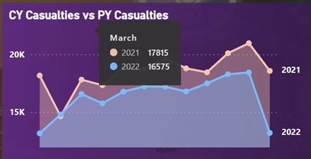

# Road-Accident-Data-Analysis-using-POWERBI

# Skills Achieved

1. **Data Analysis**: Data Extraction, Data Cleaning, Data Processing, Data Modeling, Data Integration
2. **Technical Skills**: Power BI, DAX (Data Analysis Expressions), Excel, Power Query, SQL
3. **Dashboard and Reporting**: Dashboard Design, Data Visualization, KPI Generation, Report Building
4. **Automation**: Process Automation, Data Update Automation
5. **Collaboration and Communication**: Stakeholder Collaboration, Cross-Functional Teamwork, Effective Communication of Insights, Requirement Gathering
6. **Problem-Solving**: Identifying Data Issues, Implementing Data Solutions
7. **Project Management**: Timely Project Execution, Meeting Project Deadlines

## Steps Involved:

1. **Requirement Gathering**
2. **Stakeholders in Project**
3. **Raw Data Overview and Connecting Data with Power BI**
4. **Data Cleaning**
5. **Data Processing**
6. **Data Modelling**
7. **Data Visualization/ Charts Design**
8. **Report/ Dashboard Building**

# 1) REQUIREMENTS GATHERING:

Clients want to create a Road Accident Dashboard for the years 2021 and 2022 to gain insights into the following requirements:

## Primary KPI’s:
- Total Casualties and Total Accident values for the Current Year and YoY growth.
- Total Casualties by Accident Severity for the Current Year and YoY growth.

## Secondary KPI's:
- Total Casualties with respect to vehicle type for the Current Year.
- Monthly trend showing a comparison of casualties for the Current Year and Previous Year.
- Casualties by Road Type for the Current year.
- Current Year Casualties by Area/Location & by Day/Night.
- Total Casualties and Total Accidents by Location.

# 2) STAKEHOLDERS :

- Ministry of Transport
- Road Transport Department
- Police Force
- Emergency Services Department
- Road Safety Corps
- Transport Operators
- Traffic Management Agencies
- Public
- Media

# Functionalities of PowerBI used :

1. How to connect raw data/flat file
2. Data cleaning in power query
3. Data processing
4. Time Intelligence Function/Calendar Data Table
5. Data Modelling (Relationship bwn Multiple Tables)
6. YTG and YOY Growth Calculations using DAX
7. KPI and advanced KPI generations
8. Creating custom columns and measures in reports
9. Importing images
10. Creating different charts and generating insights
11. Export report to users

# 3) Raw Data Overview and Connecting data to PowerBI : 

- Data can be provided via excel, databases, cloud, etc.
- We will use the road accidents excel file, 3 lakh+ rows, 21 columns.
- 60–70% of work is done on studying data.
- Loaded excel data to Power BI.
There are three main views:
- Report View – Building Visuals and dashboard.
- Table View – Data in table format to add new columns or data.
- Model View – Multiple tables to connect with primary and foreign keys (Data Modeling).

# 4) Data cleaning:
- Check null values, nulls, spelling mistakes, etc.
- For cleaning data, select transform data in the home tab; this will take us to Power Query Editor.
- Select replace values and change Fetal to Fatal.
- -	Exit and data changes will be applied automatically

# 5) Data Processing:

**Primary KPI: Total Casualties and Total Accident values for the Current Year and YoY growth.**

- Create a date/calendar table if there is any date column in the dataset to extract dates, weeks, months, etc.
- Ensure the time intelligence option is enabled in options in the file menu.
- Use the CalendarAuto function.
- `CalendarAuto(1)` means that it starts with February month.

- But this function is giving all dates from 1899 which is not required in our usecase hence lest use calendar function

-	To not make it hardcoded with 2021 and 2022 we can use min(accident date) and max(accident date) as start and end dates respectively
-	Now new calendar table is ready using time intelligence functions

-	Connect both original and calendar table using data model tab

# 6) Data Modeling:

- One-to-many relations have been established because the calendar data is unique, but the accident date is not unique; many accidents can happen on the same day.

# 7) Data Visualization/Charts Design:

- To find the total current year casualties, create a new measure and use the TOTALYTD function.

-	Formatting Visual CurrYearCasualties to a different format
-	We Created a ppt background to place the cards and beautify our dashboard.
-	Now import the background and insert KPI

## YOY Growth : 
-	YoYgrowth = (Curr year cas – prev year cas)/prev year cas
-	First determine prev year casualties

-	We used this formula to calculate prevyearcasualties = CALCULATE(SUM(Data[Number_of_Casualties]), SAMEPERIODLASTYEAR('calendar'[Date]))
-	Now create another YoYgrowth measure and add that to dashboard

## Total Accidents and YoY growth :
-	Similarly as before 

# KPI 2 : Total Casualities by Accident Severity for Current year and YoY growth

-	Just filtering fatal severity

-	Here Fatal casualities represent who are badly injured in an accident similarly serious and slight

# KPI 3 : Total Casualities with respect to vehicle type for current year
-	There are many vehicle types here we need to group them to get those minimalistic groups

-	We used group by option and created 6 groups for the vehicles.
-	We can add images as well

# KPI 4 : Monthly trend showing Comparison of casualities for Current year and previous years

- Just use the month column in the date field and create a chart with month on x axis and date on y axis with changing to date hierarchy

-	Adjust the seeting to look into this way, use sort function if needed to sort the months

- Add Donut charts by just drag and drop the column values

## MAPS : 
- For maps on the map access in security and add longitude, latitude to get locations and decorate it.

## Filter Properly :
- To filter everything else based on one selection, enable the edit interations and check all the filter actions to ON.

## Slicers :
- Slicers as dropdowns to select , insert values into slicer and adjust accordingly.

